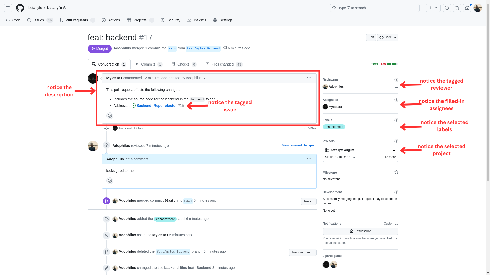

# Contribution Guidelines

- Always make sure to pull from main.

- When working on a feature be sure to name your branch in the format `feat/<initials>_<feature-name>`.
  For example:
  Suppose I'm working on a feature for video streaming and my full name is John Doe, I will create a feature branch like so `feat/jd_video-streaming`.

- Whenever you want to make a contribution upstream (to main), be sure to do so in the form of a [Pull Request](https://docs.github.com/en/pull-requests/collaborating-with-pull-requests/proposing-changes-to-your-work-with-pull-requests/about-pull-requests). Make sure to:
  - Tag the necessary reviewer when creating your Pull Request,
  - Specify any relevant issue (s).
  - Assign yourself and any other relevant person (s) in the asignees field.
  - Assign the necessary label (s) from the labels tab.
  - Assign the necessary project (s) from the projects tab.

- Below is an example of a proper pull request.

